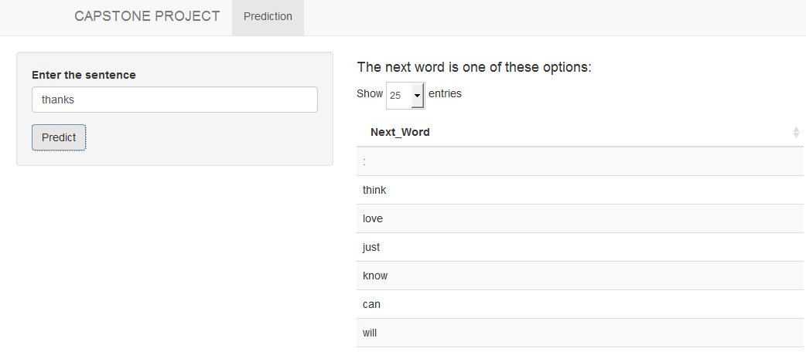

CapStone Project
========================================================
author: Mauricio Henao
date: 16-07-2016

THe objective of this project is to make an application to predict the next word base on a previus sentence.

Process
========================================================
This project was made in the next sequence:

- An exploratory analysis of the data was made such as calculating general statistics of the data, and the analysis of the distributions of the words.
- The data is sampled by 1% of the data.
- The sample data is cleaned ereasing uncommon characters, punctuation and white spaces. The data is also converted to lower case words.Articles are erased just for sentences that are identify just with one word.
- Algorithms are calculated to find the posible combinations of sentences in the sample data.
- Finally, The sentences are sought in the data base created from the algorithms.

Methods and Models
========================================================

The process to clean and to organized the data was made at the beggining with the HC Corpora data but observing the long time the package was taking to process the information, the R fundamental functions were used to clean the data and to prepared it for the algorithm.

The method used to predict the next word was frequency dictionaries calculated by n-grams.

> A ngram is a sequence of n items from a given sequence of text. ([Wiki](http://en.wikipedia.org/wiki/N-gram)) 

A bi-gram, a tri-gram and a qua-grams were calculated from the data and used as frecuency dictionaries to find the next word. 

Performance
========================================================

Application
========================================================

The sentence should be written in the white space at  enter the sentence. Then, click in the bottom predict and the result will be shown the right side with all posible words for the next word. 

